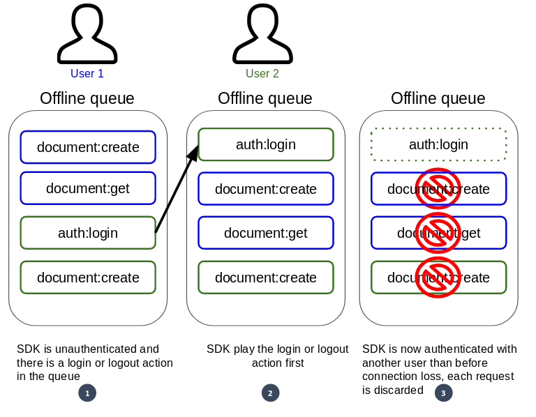

# Offline Tools

The C# SDK provides tools that allow it to be resilient to connection loss. 

## Automated queuing

Automated queuing allows the SDK to keep requests made when a connection is lost for later replay.  

::: info
This option is enabled by default and can be disabled by modifying the [Kuzzle.FailOnNetworkLoss](/sdk/csharp/1/core-classes/kuzzle/properties) property.
:::

## Connection loss

When the SDK lost the connection to Kuzzle, the following requests are stored into the offline queue.  

If an [auth:login](/sdk/csharp/1/controllers/auth/login) or [auth:logout](/sdk/csharp/1/controllers/auth/login) request is added to the queue, the SDK closes it and will not keep the following requests.  
This behavior is necessary to prevent the SDK from playing requests with the wrong credentials.

## Reconnection

When the SDK successfully reconnects to Kuzzle, the following actions are performed:
  - if an authentication token was present, and it was about to expire, then it is refreshed, otherwise it is simply checked,
  - the `reconnected` event is issued,
  - new requests are no longer put in the queue but are sent directly,
  - the SDK starts to replay the content of the offline queue.

### Replay the request queue

Requests in the offline queue are replayed in the order in which they were recorded, keeping the original time between each request.  
It is possible to specify a maximum delay between two requests by changing the [Kuzzle.MaxQueueDelay]((/sdk/csharp/1/core-classes/kuzzle/properties) property.  

Each request is removed from the offline queue only after the SDK has actually received a request from Kuzzle to ensure that all requests will be replayed even in the event of a new connection loss.

In order for the queries in the queue to be played with the right credentials, the SDK can replay the queue in 3 different ways depending on its content.  

In particular, the presence of an [auth:login](/sdk/csharp/1/controllers/auth/login) or [auth:logout](/sdk/csharp/1/controllers/auth/login) action influences the way in which the SDK will replay or not the requests.

### Case 1: Anonymous or valid authentication with no login or logout in the queue

When the SDK has currently a valid authentication or is not authenticated (user anonymous) then the following actions are performed to replay the offline queue:
  - real-time subscription renewal,
  - replay requests in the same order, taking into account the original time between each request,
  - the `recovered` event is issued when all requests have been replayed.

### Case 2: Invalid or expired authentication and no login or logout in the queue

When the SDK was authenticated and this authentication is no longer valid or expired at reconnection, then the real-time subscriptions are not renewed and the offline queue is not replayed immediately. 

When an [auth:login](/sdk/csharp/1/controllers/auth/login) or [auth:logout](/sdk/csharp/1/controllers/auth/login) request is executed normally, two scenarios are possible:
 1) the SDK is authenticated with the same user as the one of the offline queue requests then the following actions are performed:
  - real-time subscription renewal,
  - replay requests in the same order, taking into account the original time between each request,
  - the `recovered` event is issued when all requests have been replayed.

 2) the SDK is authenticated with a different user than the offline queue requests: real-time subscriptions and queue requests are rejected with an error[401](/core/1/api/essentials/errors#specific-errors).

This operation prevents the SDK from replaying requests by being authenticated with a different user than the one who made the original requests.

*Scenario 2: SDK is authenticated with another user than before connection loss:*

### Case 3: Invalid or expired authentication and login or logout in the queue

In the event that the SDK was authenticated, that this authentication is no longer valid or expired upon reconnection and that an [auth:login](/sdk/csharp/1/controllers/auth/login) or [auth:logout](/sdk/csharp/1/controllers/auth/login) action is present in the queue, then this request is replayed first.  

After executing this [auth:login](/sdk/csharp/1/controllers/auth/login) or [auth:logout](/sdk/csharp/1/controllers/auth/login) request, two scenarios are then possible:
 1) the SDK is authenticated with the same user as the offline queue requests so the following actions are performed:
  - real-time subscription renewal,
  - replay requests in the same order, taking into account the original time between each request,
  - the `recovered` event is issued when all requests have been replayed.
 2) the SDK is authenticated with a different user than the offline queue requests: real-time subscriptions and subsequent queue requests are rejected with & [401](/core/1/api/essentials/errors#specific-errors) error.

This operation prevents the SDK from replaying requests by being authenticated with a different user than the one who made the original requests.

*Scenario 2: SDK is authenticated with another user than before connection loss:*

