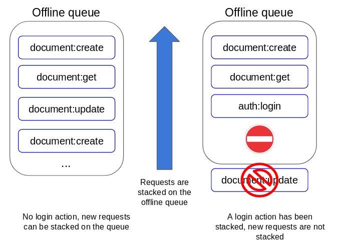
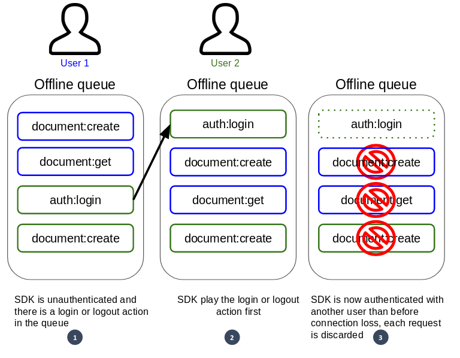

# Network Loss Resilience

The Kuzzle C# SDK provides tools that allow it to be used with an unstable network connection.

## Automatic reconnection & resubscription

::: info
Work in Progress
:::

## Automated queuing

Automated queuing allows the SDK to keep requests made when a connection is lost for later replay.  

::: info
This option is disabled by default and can be enabled by modifying the [Kuzzle.AutoRecover](/sdk/csharp/2/core-classes/kuzzle/introduction#properties) property.
:::

The queue size is configurable to avoid excessive memory consumption. You can set the [Kuzzle.MaxQueueSize](/sdk/csharp/2/core-classes/kuzzle/introduction#properties) property to limit the number of requests that can be stored on the queue.

When the SDK lost the connection to Kuzzle, the subsequent requests are stored into the offline queue.  

If an [auth:login](/sdk/csharp/2/controllers/auth/login) or [auth:logout](/sdk/csharp/2/controllers/auth/login) request is added to the queue, the SDK closes it and will not keep the following requests.  
This behavior is necessary to prevent the SDK from playing requests with the wrong credentials.

### Replay the request queue on reconnection

When the SDK successfully reconnects to Kuzzle, the following actions are performed:
  - if an authentication token was present, and it was about to expire, then it is refreshed, otherwise it is simply checked,
  - the [Reconnected](/sdk/csharp/2/essentials/events#reconnected) event is issued,
  - new requests are no longer put in the queue but are sent directly,
  - the SDK starts to replay the content of the offline queue.

::: info
You can set the [Kuzzle.MinTokenDuration](/sdk/csharp/2/core-classes/kuzzle/introduction#properties) property to adjust the time limit within which the SDK consider the current authentication token as too old and refresh it.
:::

::: info
It's possible to provide a predicate to filter the queue before the SDK play it by setting the [Kuzzle.QueueFilter](/sdk/csharp/2/core-classes/kuzzle/introduction#properties) property.
:::

Requests in the offline queue are replayed in the order in which they were recorded, keeping the original time between each request.  
It is possible to specify a maximum delay between two requests by changing the [Kuzzle.MaxQueueDelay](/sdk/csharp/2/core-classes/kuzzle/introduction#properties) property.  

Each request is removed from the offline queue only after the SDK has actually received a request from Kuzzle to ensure that all requests will be replayed even in the event of a new connection loss.

In order for the queries in the queue to be played with the right credentials, the SDK can replay the queue in 3 different ways depending on its content.  

In particular, the presence of an [auth:login](/sdk/csharp/2/controllers/auth/login) or [auth:logout](/sdk/csharp/2/controllers/auth/login) action influences the way in which the SDK will replay or not the requests.

### Case 1: Anonymous or valid authentication with no login or logout in the queue

When the SDK has currently a valid authentication or is not authenticated (anonymous user) then the following actions are performed to replay the offline queue:
  - real-time subscription renewal,
  - replay requests in the same order, taking into account the original time between each request,
  - the [Recovered](/sdk/csharp/2/essentials/events#recovered) event is issued when all requests have been replayed.

### Case 2: Invalid or expired authentication and no login or logout in the queue

When the SDK was authenticated and this authentication is no longer valid or expired at reconnection, then the real-time subscriptions are not renewed and the offline queue is not replayed immediately. 

After an [auth:login](/sdk/csharp/2/controllers/auth/login) or [auth:logout](/sdk/csharp/2/controllers/auth/login) request is manually executed, two scenarios are possible:
 1) the SDK is now authenticated with the same user as the one of the offline queue requests then the following actions are performed:
  - real-time subscription renewal,
  - replay requests in the same order, taking into account the original time between each request,
  - the [Recovered](/sdk/csharp/2/essentials/events#recovered) event is issued when all requests have been replayed.

 2) the SDK is authenticated with a different user than the offline queue requests: real-time subscriptions and queued requests are discarded with a [401](/core/2/api/essentials/error-handling#specific-errors) error.

This operation prevents the SDK from replaying requests with a different user than the one who made the original requests.

*Scenario 2: SDK is authenticated with another user than before connection loss:*

### Case 3: Invalid or expired authentication and login or logout in the queue

In the event that the SDK was authenticated, that this authentication is no longer valid or expired upon reconnection and that an [auth:login](/sdk/csharp/2/controllers/auth/login) or [auth:logout](/sdk/csharp/2/controllers/auth/login) action is present in the queue, then this request is replayed first.  

After executing this [auth:login](/sdk/csharp/2/controllers/auth/login) or [auth:logout](/sdk/csharp/2/controllers/auth/login) request, two scenarios are then possible:
 1) the SDK is now authenticated with the same user as the offline queue requests so the following actions are performed:
  - real-time subscription renewal,
  - replay requests in the same order, taking into account the original time between each request,
  - the [Recovered](/sdk/csharp/2/essentials/events#recovered) event is issued when all requests have been replayed.
 2) the SDK is authenticated with a different user than the offline queue requests: real-time subscriptions and subsequent queues requests are discarded with a [401](/core/2/api/essentials/errors#specific-errors) error.

This operation prevents the SDK from replaying requests with a different user than the one who made the original requests.

*Scenario 2: SDK is authenticated with another user than before connection loss:*

